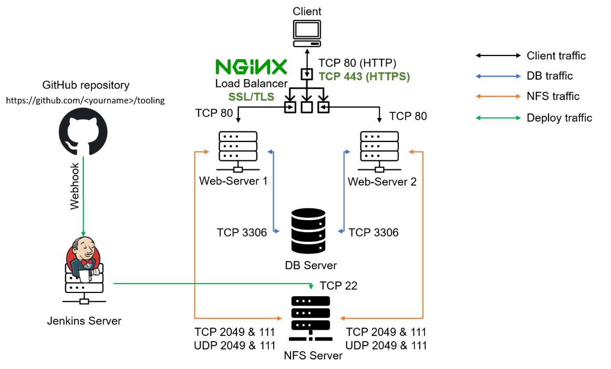
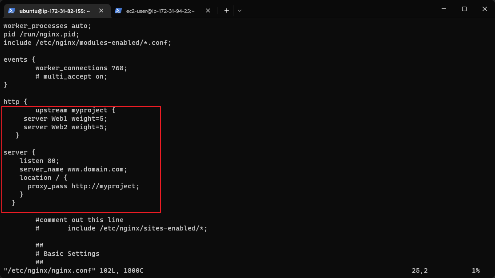
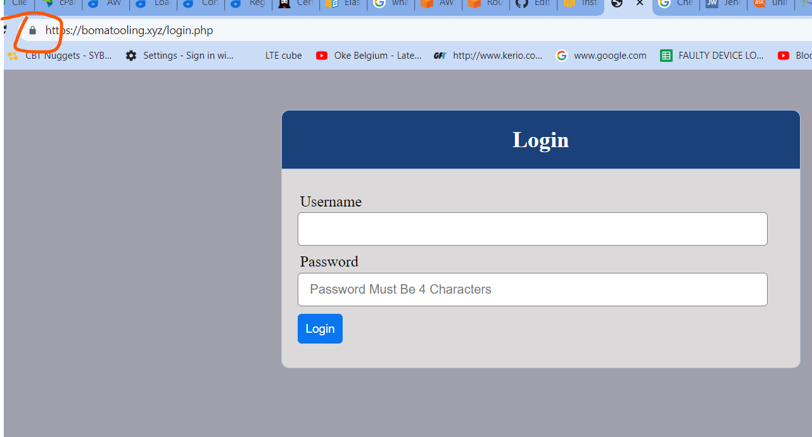

# PBL-PROJECT-10

# LOAD BALANCER SOLUTION WITH NGINX AND SSL/TLS
---

**Note:** This project is a continuation of project 7,8,9 this means that all must be up and running well before I can implement project 10. The diffrence is that I am removing Appache LB and replacing it with NGINX LB. 

The following conditions must be met for project 9 to run:

Apache (httpd) process is up and running on both web servers

All necessary TCP/UDP ports are opened on all the servers (3306, 111, 2049, 80)

Client browsers can access both web servers by their respective public IP or public DNS.

**Cloud Infracture for the Project**

Cloud Platform: AWS

OS: 3 Red Hat Enterprise Linux 8; 3 Ubuntu 20.04

**Server Applications:**

* Webserver (Red Hat Enterprise Linux 8): 2 Apache2

* Load balancer Server (Ubuntu 20.04): NGINX load balancer

* Database server (Ubuntu 20.04): MYSQL

* Storage Server (Red Hat Enterprise Linux 8): NFS server

* CI/CD Server (Ubuntu 20.04): Jenkins

**Architecture diagram:**



You can either uninstall Apache from the existing Load Balancer server, or create a fresh installation of Linux for Nginx.


1. Create an EC2 VM based on Ubuntu Server 20.04 LTS and name it Nginx LB (do not forget to open TCP port 80 for HTTP connections, also open TCP port 443 – this port is used for secured HTTPS connections)


2. Update /etc/hosts file for local DNS with Web Servers’ names (e.g. Web1 and Web2) and their local IP addresses


3. Install and configure Nginx as a load balancer to point traffic to the resolvable DNS names of the webservers


Update the instance and Install Nginx

```
sudo apt update
sudo apt install nginx
```


Configure Nginx LB using Web Servers’ names defined in /etc/hosts

Open the default nginx configuration file


**`sudo vi /etc/nginx/nginx.conf`**

```
#insert following configuration into http section

 upstream myproject {
    server Web1 weight=5;
    server Web2 weight=5;
  }

server {
    listen 80;
    server_name www.domain.com;
    location / {
      proxy_pass http://myproject;
    }
  }

#comment out this line
#       include /etc/nginx/sites-enabled/*;
```



Restart Nginx and make sure the service is up and running

```
sudo systemctl enable nginx
sudo systemctl restart nginx
sudo systemctl status nginx
```


## REGISTER A NEW DOMAIN NAME AND CONFIGURE SECURED CONNECTION USING SSL/TLS CERTIFICATES
---


Let us make necessary configurations to make connections to our Tooling Web Solution secured!


In order to get a valid SSL certificate – you need to register a new domain name, you can do it using any Domain name registrar – a company that manages reservation of domain names. The most popular ones are: Godaddy.com, Domain.com, Bluehost.com.

1. Register a new domain name with any registrar of your choice in any domain zone (e.g. .com, .net, .org, .edu, .info, .xyz or any other)

The website for my domain name: https://my.hostafrica.com/ and my domain name is bomatooling.xyz and date registered is 07/09/22 and expires 01/07/23

sudo rm -f /etc/nginx/sites-enabled/default : to disable nginx default page

Steps to link my domain name to my NGINX LB ec2

Visit AWS console, search route 53, create hosted zone, there paste your domain name and make it public
Create 2 record names using ur public IP as VALUE/ROUTE TRAFFIC, for one of the record use www as subdomain.
Visit your domain account > domain manager>nameserver, edit it and paste the links generated when creating hosted zone.
Edit /etc/nginx/nginx.conf and replace DOMAIN.COM with the domain name bomatooling.xyz www.bomatooling.xyz created and restart nginx to apply the new configurations.
LB ends here.

NOTE: NGINX up and running, Nginx is already performing its work of load balancing. However subsequent step is just to enhance the entire LB and introduce more sucurity into the system(SSL/TLS)


2. Assign an Elastic IP to your Nginx LB server and associate your domain name with this Elastic IP


    * Register a new domain name with any registrar

    * Assign an Elastic IP to Nginx LB server and associated domain name with the Elastic IP.

    * Open the Amazon EC2 console at https://console.aws.amazon.com/ec2/.

    * In the navigation pane, choose Elastic IPs.

    * Select the Elastic IP address to associate and choose Actions, Associate Elastic IP address.

    * For Resource type, choose Instance.

    * For instance, choose the instance with which to associate the Elastic IP address. You can also enter text to search for a specific instance.

    * (Optional) For Private IP address, specify a private IP address with which to associate the Elastic IP address.

    * Choose Associate.


**Note: You might have noticed, that every time you restart or stop/start your EC2 instance – you get a new public IP address. When you want to associate your domain name – it is better to have a static IP address that does not change after reboot. Elastic IP is the solution for this problem, learn how to allocate an Elastic IP and associate it with an EC2 server on this page.**


3. Update A record in your registrar to point to Nginx LB using Elastic IP address
Learn how associate your domain name to your Elastic IP on this page.


Check that your Web Servers can be reached from your browser using new domain name using HTTP protocol – http://<your-domain-name.com>

4. Configure Nginx to recognize your new domain name
Update your nginx.conf with server_name www.<your-domain-name.com> instead of server_name www.domain.com


5. Install certbot and request for an SSL/TLS certificate
Make sure snapd service is active and running

```
sudo systemctl status snapd
```

Install certbot

```
sudo snap install --classic certbot
```


Request your certificate (just follow the certbot instructions – you will need to choose which domain you want your certificate to be issued for, domain name will be looked up from nginx.conf file so make sure you have updated it on step 4).


```
sudo ln -s /snap/bin/certbot /usr/bin/certbot
sudo certbot --nginx
```


Test secured access to your Web Solution by trying to reach https://<your-domain-name.com>

You shall be able to access your website by using HTTPS protocol (that uses TCP port 443) and see a padlock pictogram in your browser’s search string.


Click on the padlock icon and you can see the details of the certificate issued for your website.


6. Set up periodical renewal of your SSL/TLS certificate


By default, LetsEncrypt certificate is valid for 90 days, so it is recommended to renew it at least every 60 days or more frequently.


You can test renewal command in dry-run mode

```
sudo certbot renew --dry-run
```

Best pracice is to have a scheduled job that to run renew command periodically. Let us configure a cronjob to run the command twice a day.


To do so, lets edit the crontab file with the following command:

```
crontab -e
```

Add following line:

```
* */12 * * *   root /usr/bin/certbot renew > /dev/null 2>&1
```

You can always change the interval of this cronjob if twice a day is too often by adjusting schedule expression.

Final Project Image:



### End of Project 10
